# MSN CHAT 

## Frequência de transmissão utilizada

A frequência de transmissão utilizada é de 2200 _Hz_ devido à melhor qualidade do sinal recebido pelo outro computador. A banda, é o dobro da frequência utilizada: 4400 _Hz_.

## Funcionamento geral do projeto
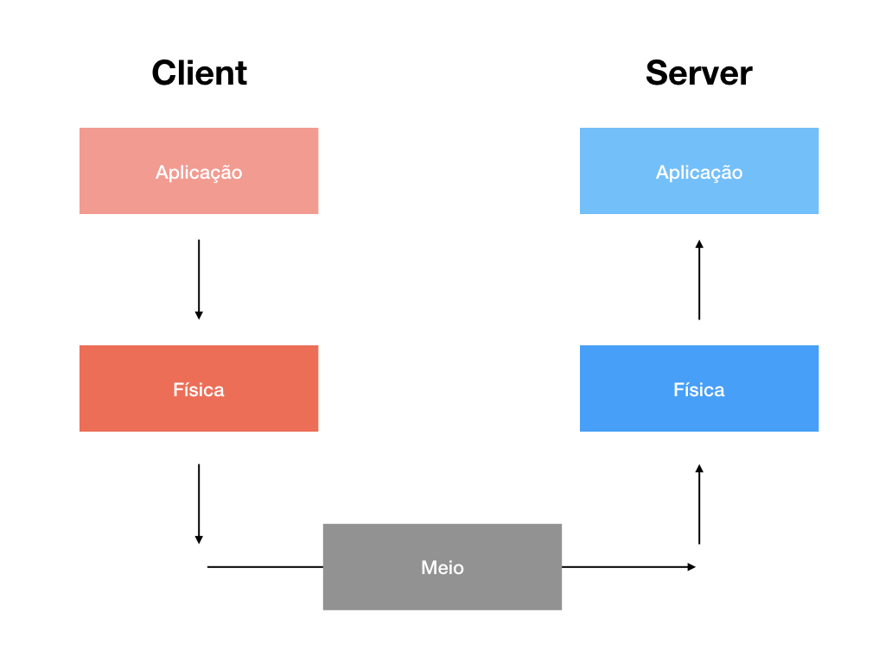

### Aplicação:
A camada de aplicação é responsável por exibir uma interface gráfica, onde um usuário pode visualizar as mensagens recebidas ( captadas pelo microfone ) e enviá-las.  Ela se comunica diretamente com a aplicação GNURadio através de sockets locais
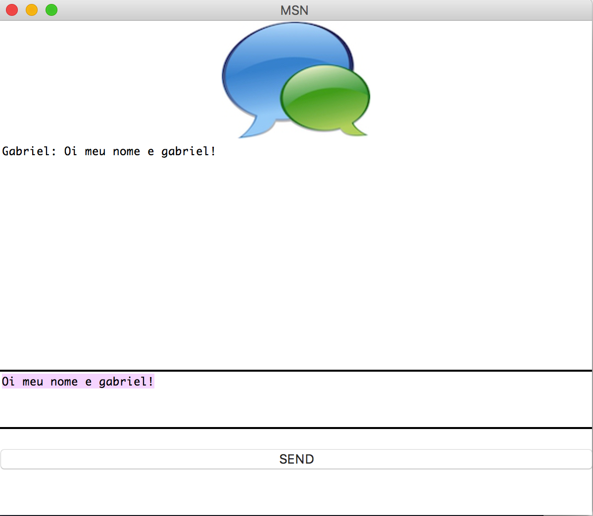

### Física:
A camada física é responsável pela modulação BPSK, que envolve a transmissão através dos componentes de áudio dos computadores, como os microfones, conversores DA/AD

### Meio:
O meio, que é o ar, é responsável por conduzir a mensagem de áudio modulada entre os respectivos speakers e microfones. Ele também pode introduzir interferência e tem um limite de banda entre 20 e 20khz para ondas mecânicas no espectro audível, por onde as mensagens modulas devem trafegar

## BPSK
BPSK significa Binary Phase Shift Keying, ou seja, é um tipo de modulação digital que muda a fase do sinal da portadora. Por ser binário, existem apenas duas fases: a fase 180 graus representa 1 e a fase 0 graus representa 0.

## Gráficos do GNU Radio 

### TX

#### Gráfico no tempo e em frequência do sinal não codificado
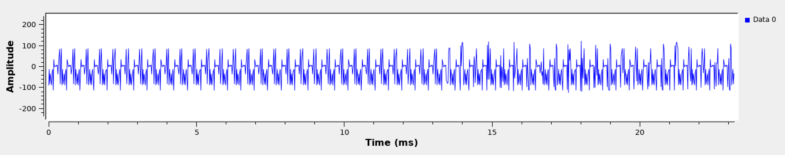
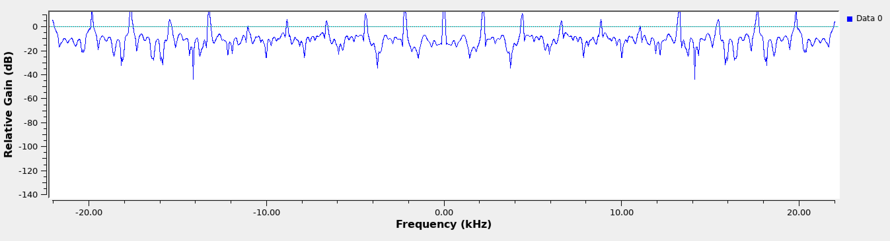 

#### Gráfico no tempo e em frequência do sinal codificado
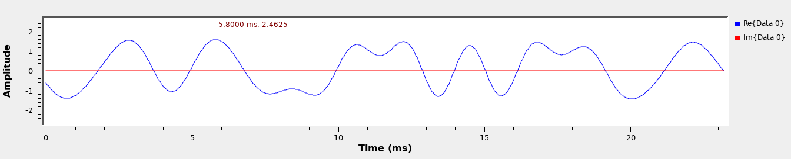
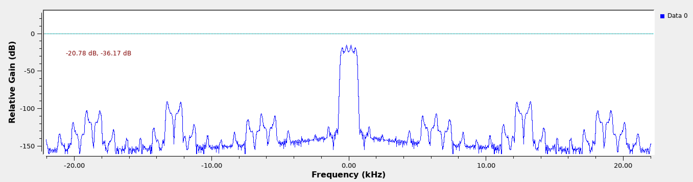

#### Gráfico no tempo e em frequência do sinal modulado
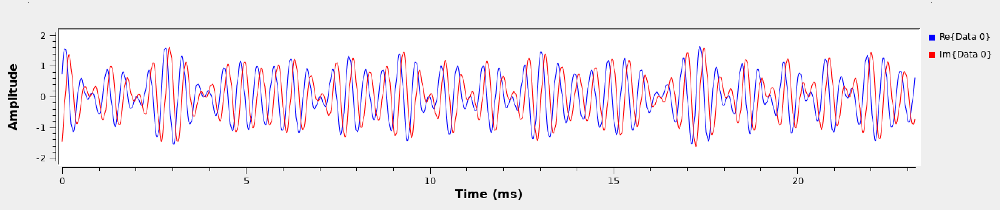
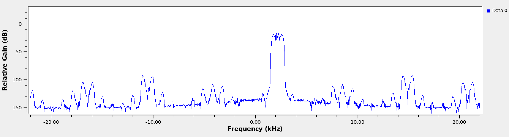

#### Diagrama de constelação
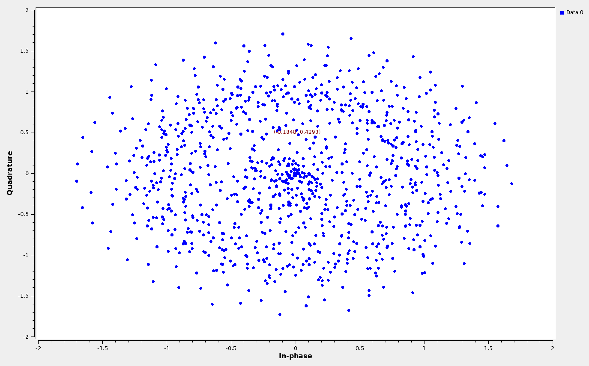

### RX

#### Gráfico no tempo e em frequência do sinal não codificado

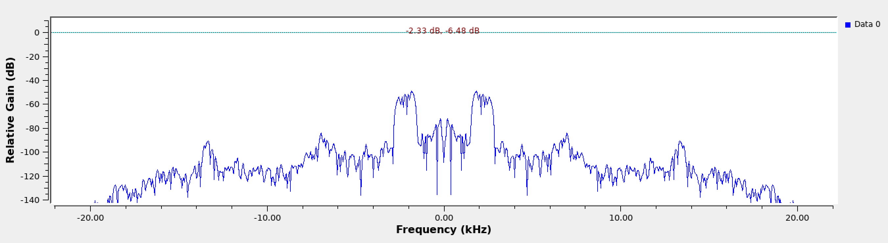

#### Gráfico no tempo e em frequência do sinal codificado
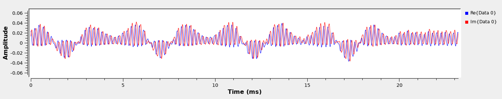
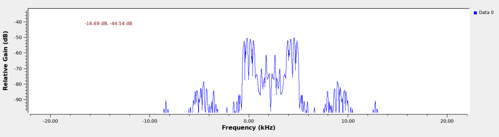

#### Gráfico no tempo e em frequência do sinal modulado
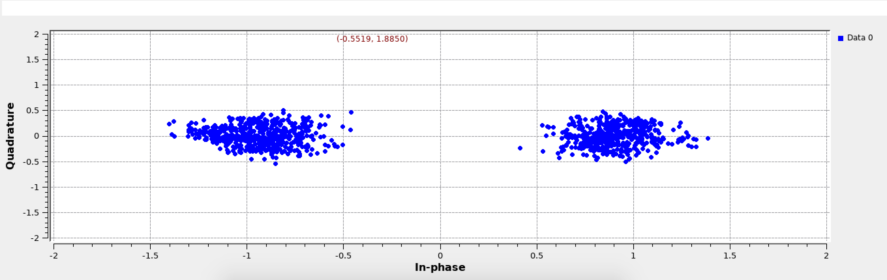

