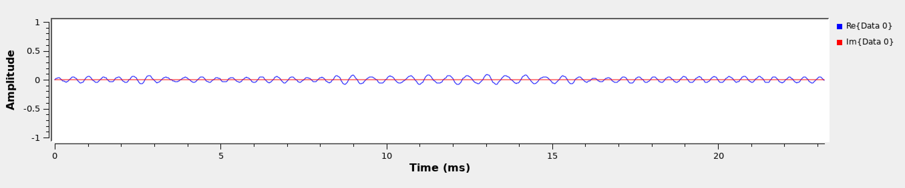

# MSN CHAT 

## Frequência de transmissão utilizada

A frequência de transmissão utilizada é de 2200 _Hz_ devido à melhor qualidade do sinal recebido pelo outro computador. A banda, é o dobro da frequência utilizada: 4400 _Hz_.

## Funcionamento geral do projeto

### Aplicação:
A camada de aplicação é responsável por 

### Física:
A camada física é responsável por 

### Meio:
O meio é responsável por 

## BPSK
BPSK significa Binary Phase Shift Keying, ou seja, é um tipo de modulação digital que muda a fase do sinal da portadora. Por ser binário, existem apenas duas fases: a fase 180 graus representa 1 e a fase 0 graus representa 0.

## Gráficos do GNU Radio 

### TX

#### Gráfico no tempo e em frequência do sinal não codificado
so falta esse

#### Gráfico no tempo e em frequência do sinal codificado

#### Gráfico no tempo e em frequência do sinal modulado

### RX

#### Gráfico no tempo e em frequência do sinal não codificado

#### Gráfico no tempo e em frequência do sinal codificado

#### Gráfico no tempo e em frequência do sinal modulado

